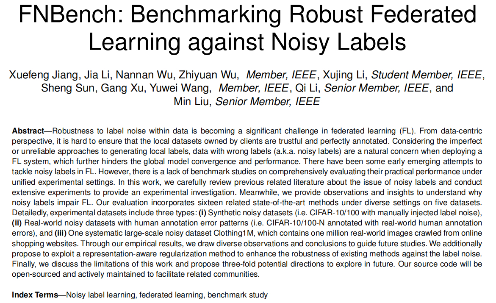

# FNBench
Official codes for our IEEE TDSC paper [FNBench: Benchmarking Robust Federated Learning against Noisy Labels (Currently under major revision)](www.techrxiv.org/users/691169/articles/1215740-fnbench-benchmarking-robust-federated-learning-against-noisy-labels). It serves as a benchmark platform for researchers to evaluate robust federated learning algorithms against noisy labels.

## Abstract
<!-- TBD. -->



## Dataset
We use CIFAR-10, CIFAR-100, CIFAR-10-N, CIFAR-100-N, and one large-scale online clothing datasets Clothing1M for evaluation. We list a table as below:

| Dataset | #Classes | #Train Set | #Test Set | Label Noise Pattern | Extra Information  |
| :-----: | :------: | :--------: | :-------: | :----------------: | :----------------: |
| CIFAR-10 |    10    |   50,000   |   10,000  | Manual Injected | -  |
| CIFAR-100|    100   |   50,000   |   10,000  | Manual Injected | -  |
| CIFAR-10-N|   10 |   50,000   |   10,000  |  Human Annotation Error | https://github.com/UCSC-REAL/cifar-10-100n  |
| CIFAR-100-N| 100  |   50,000   |   10,000  | Human Annotation Error  | https://github.com/UCSC-REAL/cifar-10-100n  |
| Clothing1M|   14 | 1,000,000  |   10,000 | Systematic | https://github.com/Cysu/noisy_label  |


For the last three datasets, considering related copyrights, please refer to the corresponding links for dataset requisition. Meanwhile, we provide an implementation code to experiment on `Clothing1M` in this [link](https://github.com/Sprinter1999/Clothing1M_FedAvg).

## Usage
> bash eval_fedelc.sh

please refer to the `./utils/options.py` for more details. 

## Key Dependencies
- Python 3.8
- PyTorch 1.8.1
- scikit-learn 1.3.2

## Awesome Resources
We recommend some useful related resources to further provide several directions for future study.

| Name | Summary | Code Link |
| --- | --- | --- |
| FedNoisy | Recommended codebase for FNLL research | [Link](https://github.com/SMILELab-FL/FedNoisy) |
| HAR Datasets (ACM Mobisys) | Recommended time-series Datasets | [Link](https://github.com/xmouyang/FL-Datasets-for-HAR) |
| FedNed (AAAI) | Recommended work to tackle extreme noisy clients | [Link](https://github.com/linChen99/FedNed) |
| FedAAAI (AAAI) | Recommended work to tackle label noise for image segmentation  | [Link](https://github.com/wnn2000/FedAAAI) |
| Buffalo (ACM CIKM) | Recommended work to tackle modality hetogeneity | [Link](https://github.com/beiyuouo/Buffalo) |
| Twin-sight (ICLR) | Recommended work to tackle semi-supervised learning | [Link](https://github.com/visitworld123/Twin-sight) |

## Citing this work
In recent years, we have proposed `FedLSR (ACM CIKM'22)`, `FedNoRo (IJCAI'23)`, `FedELC (ACM CIKM'24)`, `Dual Optim (under review)` and this benchmark study `FNBench (IEEE TDSC, under review)`. We benifit from many well-organized open-source projects. We encourage and hope more efforts can be made to study the noisy label issue in diverse research domains. If you find our work helpful, please consider following citations.

BTW, collaborations and pull requests are always welcome! If you have any questions or suggestions, please feel free to contact me : )

```bibtex
@article{Jiang_2024,
title={FNBench: Benchmarking Robust Federated Learning against Noisy Labels},
url={http://dx.doi.org/10.36227/techrxiv.172503083.36644691/v1},
DOI={10.36227/techrxiv.172503083.36644691/v1},
publisher={Institute of Electrical and Electronics Engineers (IEEE)},
author={Jiang, Xuefeng and Li, Jia and Wu, Nannan and Wu, Zhiyuan and Li, Xujing and Sun, Sheng and Xu, Gang and Wang, Yuwei and Li, Qi and Liu, Min},
year={2024},
}

@article{jiang2024tackling,
  title={Tackling Noisy Clients in Federated Learning with End-to-end Label Correction},
  author={Jiang, Xuefeng and Sun, Sheng and Li, Jia and Xue, Jingjing and Li, Runhan and Wu, Zhiyuan and Xu, Gang and Wang, Yuwei and Liu, Min},
  journal={arXiv preprint arXiv:2408.04301},
  year={2024}
}

@inproceedings{wu2023fednoro,
  title={FedNoRo: towards noise-robust federated learning by addressing class imbalance and label noise heterogeneity},
  author={Wu, Nannan and Yu, Li and Jiang, Xuefeng and Cheng, Kwang-Ting and Yan, Zengqiang},
  booktitle={Proceedings of the Thirty-Second International Joint Conference on Artificial Intelligence},
  pages={4424--4432},
  year={2023}
}

@inproceedings{kim2022fedrn,
  title={FedRN: Exploiting k-reliable neighbors towards robust federated learning},
  author={Kim, SangMook and Shin, Wonyoung and Jang, Soohyuk and Song, Hwanjun and Yun, Se-Young},
  booktitle={Proceedings of the 31st ACM International Conference on Information \& Knowledge Management},
  pages={972--981},
  year={2022}
}

@inproceedings{jiang2022towards,
  title={Towards federated learning against noisy labels via local self-regularization},
  author={Jiang, Xuefeng and Sun, Sheng and Wang, Yuwei and Liu, Min},
  booktitle={Proceedings of the 31st ACM International Conference on Information \& Knowledge Management},
  pages={862--873},
  year={2022}
}
```
