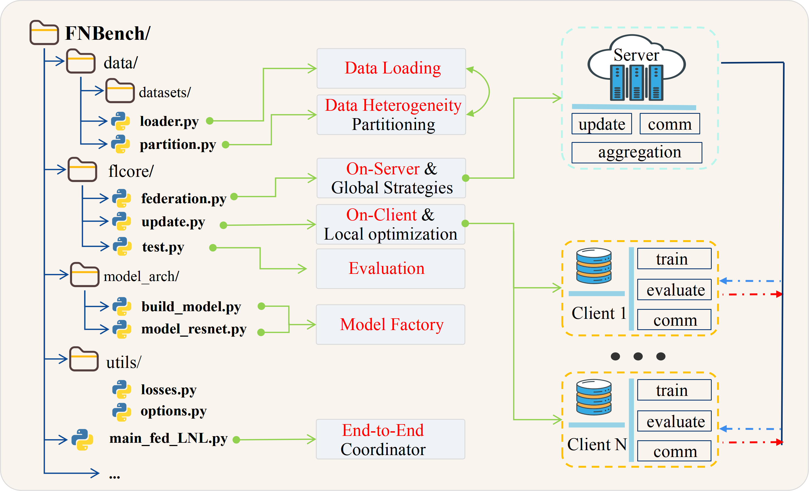

# FNBench: Benchmarking Robust Federated Learning against Noisy Labels.

This repository contains the initial official code release for our arXiv paper [FNBench: Benchmarking Robust Federated Learning against Noisy Labels](https://arxiv.org/abs/2505.06684). 


[](https://arxiv.org/abs/2505.06684)



Figure 1: Code structure for FNBench. The modular design makes it easy to extend the benchmark with new baselines, datasets, and experimental components by adding or editing modules in the corresponding folders.
To run an algorithm, execute `main_fed_LNL.py` with the target method, dataset, and partition settings.

👏 _FNBench is a **comprehensive**, **easy-to-use**, and **extensible** federated learning (FL) library and 
benchmark: It facilitates researchers to evaluate robust federated learning algorithms against 
noisy labels, while standardizing [baselines](#algorithms-with-code-updating), [datasets](#datasets), and [noise 
patterns](#noise-patterns) to enable 
controlled comparisons across algorithm families and modalities._

🎯
_What can you get?_
* This paper reports a unified benchmark and provides reproducible results for the representative [baselines](#algorithms-with-code-updating)
  spanning **General FL**, **Robust FL**, **centralized noisy-label learning** (plugged into FL), and 
  **federated noisy-label learning**.
* A benchmark protocol covering 6 [datasets](#datasets) (modality: image and text) under three distinct types of 
  label noise: **synthetic label noise**, **human-annotated errors**, and **systematic labeling errors**.
* A lightweight diagnostic that links noisy supervision to **representation degradation** (dimensional collapse), plus an optional **representation-aware regularization** as a controlled enhancement.

This repository is under active development. **[Run](#quick-start-usage-example) it on the PC and 
[contribute](#extensibility) your algorithms, datasets, noise patterns and so on to grow the 
FL community**.

## Algorithms with code (updating)

### General FL Methods
- **FedAvg** — [Communication-Efficient Learning of Deep Networks from Decentralized Data](http://proceedings.mlr.press/v54/mcmahan17a.html) *AISTATS 2017*
- **FedProx** — [Federated Optimization in Heterogeneous Networks](https://arxiv.org/abs/1812.06127) *MLsys 2020*
- **FedExP** — [FedExP: Speeding Up Federated Averaging via Extrapolation](https://arxiv.org/abs/2301.09604) *ICLR 2023*

### Robust FL Methods
- **Median** — [Byzantine-Robust Distributed Learning: Towards Optimal Statistical Rates](https://proceedings.mlr.press/v80/yin18a) *ICML 2018*
- **TrimmedMean** — [Byzantine-Robust Distributed Learning: Towards Optimal Statistical Rates](https://proceedings.mlr.press/v80/yin18a) *ICML 2018*
- **Krum** — [Krum: An Efficient and Robust Aggregation for FL](https://arxiv.org/abs/1703.02757) *NeurIPS 2017*
- **RFA** — [Robust Aggregation for Federated Learning](https://ieeexplore.ieee.org/abstract/document/9721118) *IEEE 
  TSP 2022*

### Noisy Label Learning (NLL)
- **Co-teaching** — [Co-teaching: Robust Training of Deep Neural Networks with Noisy Labels](https://arxiv.org/abs/1804.06872) *NeurIPS 2018*
- **Co-teaching+** - [How does Disagreement Help Generalization against Label Corruption?](https://proceedings.mlr.press/v97/yu19b.html) *ICML 2019*
- **Joint Optim** - [Joint Optimization Framework for Learning With Noisy Labels](https://openaccess.thecvf.com/content_cvpr_2018/papers/Tanaka_Joint_Optimization_Framework_CVPR_2018_paper.pdf) *CVPR 2018*
- **SELFIE** — [Selfie: Refurbishing unclean samples for robust deep learning](https://proceedings.mlr.press/v97/song19b.html) 
  *ICML 2019*
- **Symmetric CE** — [Symmetric Cross-Entropy for Robust Training on Noisy Labels](https://openaccess.thecvf.com/content_ICCV_2019/html/Wang_Symmetric_Cross_Entropy_for_Robust_Learning_With_Noisy_Labels_ICCV_2019_paper.html) 
  *ICCV 2019*
- **DivideMix** — [DivideMix: A Robust Approach to Noisy Label Learning](https://arxiv.org/abs/2002.07394) *ICLR 2020*

### Federated Noisy Label Learning (FNLL)
- **RobustFL** — [Robust Federated Learning with Noisy Labels](https://ieeexplore.ieee.org/abstract/document/9713942) *IEEE Intelligent 
  Systems 2022*
- **FedLSR** — [FedLSR: Federated Learning with Label-Space Regularization](https://dl.acm.org/doi/abs/10.1145/3511808.3557475) *ACM CIKM 2022*
- **FedRN** — [FedRN: Federated Learning with Noisy Labels in the Presence of Label Noise](https://arxiv.org/abs/2205.01310) *ACM CIKM 2022*
- **FedNoRo** — [FedNoRo: Federated Learning with Noisy Labels and Robust Optimization](https://arxiv.org/abs/2305.05230) *IJCAI 2023*
- **FedELC** - [Tackling Noisy Clients in Federated Learning with End-to-end Label Correction](https://dl.acm.org/doi/10.1145/3627673.3679550) *CIKM 2024*

[//]: # (- **FedDiv** - [FedDiv: Collaborative Noise Filtering for Federated Learning with Noisy Labels]&#40;https://dl.acm.org/doi/10.1609/aaai.v38i4.28095&#41; *AAAI 2024*)
[//]: # (- **FedNed** - [Federated Learning with Extremely Noisy Clients via Negative Distillation]&#40;https://dl.acm.org/doi/abs/10.1609/aaai.v38i13.29329&#41; *AAAI 2024*)
[//]: # (- **FedELR** - [When federated learning meets learning with noisy labels]&#40;https://dl.acm.org/doi/10.1016/j.neunet.2025.107275&#41; *Neural Networks 2025*)

_For FedELR re-implementation, please kindly refer to [the original paper](https://papers.ssrn.com/sol3/Delivery.cfm?abstractid=4995227) since it has no official implementation. For FedNed, please refer to its public [repository](https://github.com/linChen99/FedNed). We also provide one implementation of one new work [MaskedOptim](https://github.com/Sprinter1999/MaskedOptim)._


## Datasets
**FNBench** includes datasets spanning various domains to address label noise in both image and text classification 
tasks. We move the common dataset splitting code into `./data/partition.py` for easy extension. For _image tasks_, we use **CIFAR-10**, **CIFAR-100**, **CIFAR-10-N**, **CIFAR-100-N**, and one large-scale online clothing dataset **Clothing1M** for evaluation. 
For _text tasks_, we use **AGNews** for evaluation.
We list a table as below:

|                                                                                   Dataset                                                                                    |   Model   | #Classes | #Train Set | #Test Set |   Label Noise Pattern   | 
|:----------------------------------------------------------------------------------------------------------------------------------------------------------------------------:| :-------: | :------: | :--------: | :-------: |:-----------------------:|
|                                                           [CIFAR-10](https://www.cs.toronto.edu/~kriz/cifar.html)                                                            | ResNet-18 |    10    |   50,000   |  10,000   |        Synthetic        |
|                                                           [CIFAR100](https://www.cs.toronto.edu/~kriz/cifar.html)                                                            | ResNet-32 |   100    |   50,000   |  10,000   |        Synthetic        | 
|                                                           [CIFAR-10-N](https://github.com/UCSC-REAL/cifar-10-100n) <br/>                                                          | ResNet-18 |    10    |   50,000   |  10,000   | Human Annotation Errors |
|                                                          [CIFAR-100-N](https://github.com/UCSC-REAL/cifar-10-100n)                                                           | ResNet-32 |   100    |   50,000   |  10,000   | Human Annotation Errors |
|                                                              [Clothing1M](https://github.com/Cysu/noisy_label)                                                               | ResNet-50 |    14    | 1,000,000  |  10,000   |    Systematic Errors    |
|                                             [AGNews](https://www.kaggle.com/datasets/amananandrai/ag-news-classification-dataset)                                              | FastText  |    4     |  120,000   |   7,600   |        Synthetic        |

_For the datasets `CIFAR-10-N`, `CIFAR-100-N`, and `Clothing1M`, considering related copyrights, please refer to the 
corresponding 
links for dataset requisition. Meanwhile, we provide an implementation code to experiment on `Clothing1M` in this [codebase](https://github.com/Sprinter1999/Clothing1M_FedAvg)._

### Noise Patterns
FNBench covers three complementary noise settings to support controlled and reproducible robustness evaluation:
- **Synthetic Label Noise**:
  - Symmetric noise: flip true labels uniformly to other classes.
  - Pairflip noise: flip true labels to a specific class.
  - Mixed noise: half clients use symmetric, half clients use pairflip.

- **Human Annotation Errors**: Simulated via crowdsourced labels from platforms (Amazon Mechanical Turk) to reflect 
  real-world human annotation errors.
- **Systematic Labeling Errors**: Introduced via noisy pipelines such as those used in large-scale web scraping for data collection.

## Environments

Install [CUDA](https://docs.nvidia.com/cuda/cuda-toolkit-release-notes/index.html) (or make sure the NVIDIA driver stack is available on your machine).

For reproducibility, we recommend creating a dedicated environment and installing PyTorch, torchvision, and torchtext from a single channel.

```bash
conda create -n fnbench python=3.10 -y
conda activate fnbench

# install the PyTorch stack
conda install -y -c pytorch -c nvidia pytorch torchvision torchaudio pytorch-cuda=11.8
conda install -y -c pytorch torchtext

# install other python dependencies
pip install -r requirements.txt
```

## Quick Start (Usage Example)

Download this project:
```
git clone https://github.com/Sprinter1999/FNBench.git
cd FNBench
```

Run a baseline experiment (example: FedAvg):

> bash eval_fedavg.sh

_Please refer to the `./utils/options.py` for more details about key arguments and options. For CIFAR-N experiments, 
please use the dedicated entry scripts (like `main_fed_LNL_cifar10N.py`). We recommend you to experiment on Nvidia 
3090 (24G) GPUS or more advanced GPUs.

You can also run a single command manually:

```
python main_fed_LNL.py \
--dataset cifar10 \
--model resnet18 \
--epochs 120 \
--noise_type_lst pairflip \
--noise_group_num 100  \
--group_noise_rate 0.0 0.4 \
--partition dirichlet \
--dd_alpha 1.0 \
--method fedavg | tee ./log/fedavg_cifar10_pair04_dirichlet10.txt
```

## Extensibility

**FNBench** is organized around a small set of "registries" in code. Most extensions only require editing 2 or 3 files.

### New Dataset

All datasets are created in `./data/datasets/loader.py` via `load_dataset(dataset)`, which returns:

- dataset_train, dataset_test
- num_classes
- collate_fn (optional, mainly for text/sequence)

Recommended steps:

1) Create a new dataset in `./data/datasets`, for example:

```python
# ./data/datasets/mydataset.py
from torch.utils.data import Dataset

class MyData(Dataset):
    def __init__(self, root, train=True, transform=None):
        self.root = root
        self.train = train
        self.transform = transform

        # load your data here
        self.data = ...
        self.train_labels = ...  # list or numpy array, must be writable

    def __len__(self):
        return len(self.data)

    def __getitem__(self, idx):
        x = self.data[idx]
        y = self.train_labels[idx]
        if self.transform is not None:
            x = self.transform(x)
        return x, y
```

2) Register it `./data/loader.py`.
```python
# ./data/loader.py
from .mydata import MyData

def load_dataset(dataset):
    ...
    elif dataset == "mydata":
        dataset_train = MyData(root="./data/mydata", train=True, transform=...)
        dataset_test = MyData(root="./data/mydata", train=False, transform=...)
        num_classes = ...
        collate_fn = None  # set this if you need custom padding/batching
    ...
```

3) Add the dataset name to CLI choices in `./utils/options.py`
```python
parser.add_argument(
  "--dataset",
  type=str,
  default="cifar10",
  choices=["cifar10", "cifar100", "AGNews", "mydata"]
)
```

### New Noise Type

Synthetic label noise is injected in `main_fed_LNL.py` by calling `noisify_label(...)` in `./utils/utils.py`

Recommended steps:

1) Add your noise rule in `utils/utils.py`.

```python
# utils/utils.py
def noisify_label(true_label, num_classes=10, noise_type="symmetric"):
    if noise_type == "symmetric":
        ...
    elif noise_type == "pairflip":
        ...
    elif noise_type == "my_noise":
        # implement your transition rule here
        return new_label
```

2) Use it from CLI.

```python
python main_fed_LNL.py \
  --noise_type_lst my_noise \
  --noise_group_num 100 \
  --group_noise_rate 0.0 0.4 \
```

### New Data Partitioning

Non-IID partitioning is implemented in `./data/partition.py` and used in `main_fed_LNL.py` via `--partition`.

Recommended steps:

1) Implement a new sampler in `./data/partition.py`.

```python
def sample_my_partition(labels, num_users, ...):
    # return dict_users: {client_id: [sample_indices]}
    return dict_users
```

2) Add a new option in `utils/options.py`.

```python
parser.add_argument(
  "--partition",
  type=str,
  default="IID",
  choices=["shard", "dirichlet", "IID", "my_partition"]
)
```

3) Add a branch in `main_fed_LNL.py` where it selects the partitioning function.

### New Algorithm (Baseline)

Local training logic is implemented as a "local updater" in `./flcore/update.py`.
The constructor is created in `get_local_update_objects(args, ...)` based on `args.method`.

Recommended steps:

1) Add a new local updater class in `./flcore/update.py` by inheriting `BaseLocalUpdate`.

```python
# flcore/update.py
class LocalUpdateMyMethod(BaseLocalUpdate):
    def train_single_model(self, net):
        # implement your local training step
        # return updated weights and any method-specific info
        return w, loss
```

2) Register it in `get_local_update_objects(...)`.

```python
if args.method == "mymethod":
    local_update_object = LocalUpdateMyMethod(**local_update_args)
```

3) Add the method name to CLI choices in `utils/options.py`.
```python
parser.add_argument(
  "--method",
  type=str,
  default="fedavg",
  choices=[..., "mymethod"]
)
```
If your method needs a customized aggregation rule, implement it in `flcore/federation.py`:
- Aggregation entry: `LocalModelWeights.average()`
- Add a new `elif self.method == "mymethod": ...` branch
- Implement a standalone aggregator function similar to `FedAvg`, `Krum`, `trimmed_mean`, or `RFA`

### New Model

All models are built in `./model_arch/build_model.py` via `build_model(args)`.
1) Add a model file `under ./model_arch/`, for example `model_arch/my_model.py`
2) Register it in `./model_arch/build_model.py`

3) Add the model name to CLI choices in `./utils/options.py`
```python
parser.add_argument(
  "--model",
  type=str,
  default="resnet18",
  choices=["resnet18", "resnet34", "resnet50", "resnet20", "fasttext", "mymodel"]
)
```
If your method needs a customized aggregation rule, implement it in `./flcore/federation.py`:
- Aggregation entry: `LocalModelWeights.average()`
- Add a new `elif self.method == "mymethod": ...` branch
- Implement a standalone aggregator function similar to `FedAvg`, `Krum`, `trimmed_mean`, or `RFA`


## Awesome Resources

We recommend some useful related resources to further provide **several relevant directions** for future study.

|            Name            |                           Summary                            |                         Code Link                         |
| :------------------------: | :----------------------------------------------------------: | :-------------------------------------------------------: |
|          FedNoisy          |            Recommended codebase for FNLL research            |      [Link](https://github.com/SMILELab-FL/FedNoisy)      |
|     Clothing1M_FedAvg      |        Recommended codebase for FedAvg on Clothing1M         | [Link](https://github.com/Sprinter1999/Clothing1M_FedAvg) |
|           FedRN            |             Referred codebase for implementation             |         [Link](https://github.com/ElvinKim/FedRN)         |
| HAR Datasets (ACM Mobisys) |               Recommended time-series Datasets               |  [Link](https://github.com/xmouyang/FL-Datasets-for-HAR)  |
|      FedDSHAR (FGCS)       |   Recommended work to tackle noisy labels for time-series    |      [Link](https://github.com/coke2020ice/FedDSHAR)      |
|       FedNed (AAAI)        |       Recommended work to tackle extreme noisy clients       |        [Link](https://github.com/linChen99/FedNed)        |
|       FedAAAI (AAAI)       | Recommended work to tackle label noise for image segmentation |        [Link](https://github.com/wnn2000/FedAAAI)         |
|     Buffalo (ACM CIKM)     |       Recommended work to tackle modality heterogeneity        |        [Link](https://github.com/beiyuouo/Buffalo)        |
|     Twin-sight (ICLR)      |     Recommended work to tackle semi-supervised learning      |    [Link](https://github.com/visitworld123/Twin-sight)    |
|       FedCNI (ICME)        | Noise-resilient local solver + robust global aggregation for noisy and heterogeneous clients; no official public code found |         [Paper](https://arxiv.org/abs/2304.02892)         |
|        GGEUR (CVPR)        | Geometry-guided embedding uncertainty representation for localized global distribution alignment |  [Link](https://github.com/WeiDai-David/2025CVPR_GGEUR)   |
|      FedClean (ICML)       |            Robust label noise correction for FL;             | [Paper](https://proceedings.mlr.press/v267/jiang25m.html) |
|      FedCorr  (CVPR)       | Multi-stage framework for heterogeneous label noise correction in FL |     <br/>[Link](https://github.com/Xu-Jingyi/FedCorr)     |


## Acknowledgements

In recent years, we have proposed `FedLSR (ACM CIKM'22)`, `FedNoRo (IJCAI'23)`, `FedELC (ACM CIKM'24)`, `FedDSHAR (FGCS)` ,`Dual Optim (under review)` and this benchmark study `FNBench (IEEE TDSC, under review)`. 
We benefit from many well-organized open-source projects.
We encourage and hope more efforts can be made to study the noisy label issue in diverse research domains. If you find our work helpful, please consider following citations.

By the way, collaborations and pull requests are always welcome! If you have any questions or suggestions, please feel free to contact me : )

```bibtex
@article{Jiang_2024,
title={FNBench: Benchmarking Robust Federated Learning against Noisy Labels},
url={http://dx.doi.org/10.36227/techrxiv.172503083.36644691/v1},
DOI={10.36227/techrxiv.172503083.36644691/v1},
publisher={Institute of Electrical and Electronics Engineers (IEEE)},
author={Jiang, Xuefeng and Li, Jia and Wu, Nannan and Wu, Zhiyuan and Li, Xujing and Sun, Sheng and Xu, Gang and Wang, Yuwei and Li, Qi and Liu, Min},
year={2024},
}

@article{jiang2024tackling,
  title={Tackling Noisy Clients in Federated Learning with End-to-end Label Correction},
  author={Jiang, Xuefeng and Sun, Sheng and Li, Jia and Xue, Jingjing and Li, Runhan and Wu, Zhiyuan and Xu, Gang and Wang, Yuwei and Liu, Min},
  journal={arXiv preprint arXiv:2408.04301},
  year={2024}
}

@inproceedings{wu2023fednoro,
  title={FedNoRo: towards noise-robust federated learning by addressing class imbalance and label noise heterogeneity},
  author={Wu, Nannan and Yu, Li and Jiang, Xuefeng and Cheng, Kwang-Ting and Yan, Zengqiang},
  booktitle={Proceedings of the Thirty-Second International Joint Conference on Artificial Intelligence},
  pages={4424--4432},
  year={2023}
}

@inproceedings{kim2022fedrn,
  title={FedRN: Exploiting k-reliable neighbors towards robust federated learning},
  author={Kim, SangMook and Shin, Wonyoung and Jang, Soohyuk and Song, Hwanjun and Yun, Se-Young},
  booktitle={Proceedings of the 31st ACM International Conference on Information \& Knowledge Management},
  pages={972--981},
  year={2022}
}

@inproceedings{jiang2022towards,
  title={Towards federated learning against noisy labels via local self-regularization},
  author={Jiang, Xuefeng and Sun, Sheng and Wang, Yuwei and Liu, Min},
  booktitle={Proceedings of the 31st ACM International Conference on Information \& Knowledge Management},
  pages={862--873},
  year={2022}
}
```